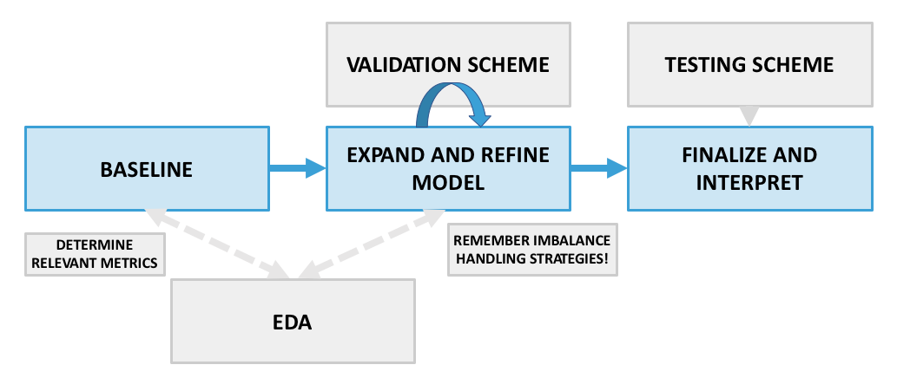

## Classification Project Workflow

This workflow should be viewed as **helpful guiding framework** rather than an exact prescription of what to do and the order to do it in. Guidelines are helpful, but they must be combined with good judgment (enhanced through experience) in order to complete successful projects.

---
---

### How to build and test a classification model

**1. Exploratory data analysis and metric selection**

* **Look at, summarize, and clean the data**. Examine at least some rows in micro detail, checking that the data is correct and appears as you expected (e.g., number of customers should not be negative!). Also study the macro level by aggregating the data and looking at summary information and statistics (what is the data type, how many entries and missing values are there, what are some descriptive statistics like mean for numerical columns, etc.) Significant preprocessing/data preparation may be called for in cases of messy/problematic data.

* **Scope out classification viability**: Look at key statistics and visualizations related to classification - correlation matrix, target distribution (how imbalanced are the classes you're predicting?), target vs. feature plots (e.g. seaborn pairplot with the target value passed as a hue, see [logistic regression notebook](../logistic-regression) for a good example). Get some initial expectations for model performance and identify features that intuitively, visually, and based on their per-class distributions (e.g. box plots by target class) are likely to work well. 

* **Determine the most relevant classification metric(s)**: Given the model's use case and the distribution of the target, what [metrics](../classification-metrics) are most relevant for this problem? It's critical to establish this **before modeling** so that you can properly decide how well a model is actually working. Is the class distribution balanced and accuracy is a meaningful metric? Do you need to have good recall and precision for the positive class (use F1)? Is recall more important than precision (use F_beta with beta > 1, care about recall beta times more than precision)? Is it a probability ranking problem (use ROC AUC)? Think carefully about cost-benefit analysis from the use case perspective to decide on the right metric(s).

Note the diagram's suggested nuance in how EDA fits into the classification workflow: it's typical to constantly return to EDA for further cleaning and feature exploration as you build understanding and evidence in the modeling portion of the workflow. 

**2. Baselining** 

Build a simple baseline model such as [logistic regression](../logistic-regression/), [knn](../knn-classification-intro/), or [naive bayes](../naive-bayes/), using a small handful of features (you might get lucky and be able to explain your targets with very few features). Start with features that are most likely to be predictive based on your domain knowledge and EDA (step 1) and/or are simple to handle (e.g. numeric without null values). Calculate the [model evaluation metrics](../classification-metrics/) you've determined are relevant to get a baseline score and feel for how well the model can perform. Ideally, calculate the baseline score on a hold out set as in part 3, not the training data.

**3. Establish a validation and testing scheme**

 Set up a data splitting structure for validating and testing your model. Cross-validation will often be preferable to simple, single-set validation due to its robustness. There may also be cases where a specialized validation setup is called for, such as in time series problems. Using your chosen validation scheme, you can perform iterative feature selection/expansion/engineering and model complexity adjustments in order to complete the next 2 steps. You will use the test data only once your model is finalized in order to compute a final estimate of generalization performance.

**4. Expand and refine model** 

 Starting from the baseline and in an iterative, validated loop, continue to ask: do you need more complexity or less (underfitting vs. overfitting)? Do you need a fancier model (nonlinear, additional [feature engineering](../feature-engineering-classification) / transformations)? If you need more complexity, try tree-based models such as [random forest](../classification-and-regression-trees) or [gradient boosted trees](../gradient-boosted-trees). Or instead are you overfitting and need to make your model more conservative by removing features or using regularization? Hopefully you can quickly acquire an understanding of which direction you need to go in from your baseline and early modeling results, then make more fine-tuned changes as you go.
 
If your target class distribution is (highly) imbalanced, make sure to try [imbalance handling strategies](../class-imbalance) such as resampling, class_weight adjustments, and decision threshold tuning that dovetail with the metrics you’re most interested in. These methods are part of the modeling process, whether they happen before, during, or after training. 

The impact of model choices should be consistently measured against the same validation data as in part 3, using your relevant classification performance metrics such as F1 or ROC AUC. The [feature engineering lesson](../feature-engineering-classification) provides a model for how you might track your progress while iteratively expanding your model.       

**5. Finalize, test, and interpret your model** 
* **Finalize and test**: when satisfied with the results of your tuning in step 4, establish your final model choices (features, preprocessing, imbalance handling strategy, and hyperparameters) and retrain this model on all training + validation data. Make predictions on the test data and score these predictions, reporting this score as your estimate of the model's generalization performance.   

* **Interpret**: extract and study your final model coefficients or feature importances. Are there any interesting or unexpected takeaways? How do the model coefficients/importances align with your intuition and domain knowledge about the problem? Be careful about complicating factors in interpretation such as differing feature scales and multicollinearity.        

---

**Other considerations and subtleties**

 There are many complex choices and tradeoffs that go into model design, and the above framework makes some assumptions including reasonably small data and prediction-focused model goals. In real world projects, some considerations that may impact/change the steps above include:

* **Data scale**: with larger data sets (e.g. 10 million+ records), it's typically more practical to perform baselining (step 2) and model selection (step 4) on a representative subset of the data rather than all of it. This is less resource (RAM) intensive and less time consuming, so will almost always be best practice.

* **Predictive vs. interpretive model goals**: in many projects, understanding the problem and its driving feature/target relationships in a clear way competes for importance with pure predictive performance. A simpler model with a few key features that can be easily explained to stakeholders can have much more business value than a complex model with a marginally improved accuracy, F1, or ROC AUC. This can have a very significant impact on the process and choices made in step 4 (e.g. adding too many features or using a highly sophisticated model like gradient boosting may harm the project goals, even if performance metrics go up). It's always best to establish a **clear sense of model purpose** and think about how to navigate these tradeoffs in advance, so that you don't fall into the trap of prioritizing score above all else. Note that in some cases, a compromise available is to train multiple models with their own emphasis -- e.g. one focused on prediction, one focused on interpretation.

* **Model scalability, speed, and maintainability**: when models are deployed as part of a live application, it can be critical that they make predictions quickly and are easy to recurrently update. This can place limitations on the scope of model complexity, the types of features used, etc. that can have a big impact on the model choices made in step 4 and also add an application/engineering performance testing element to step 5. 
    

