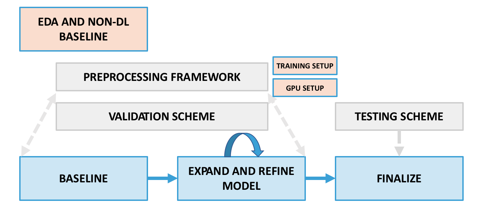

## Deep Learning Project Workflow

This workflow should be viewed as **helpful guiding framework** rather than an exact prescription of what to do and the order to do it in. Guidelines are helpful, but they must be combined with good judgment (enhanced through experience) in order to complete successful projects.

---
---

### How to build and test a deep learning model

**1. Exploratory data analysis and metric selection**

* **Look at and summarize the data**. Examine at least some datapoints in micro detail, checking that the data is correct and appears as you expected (e.g. text documents should be formatted correctly and complete, images or audio should not be corrupted). As appropriate, also study the macro level by aggregating the data and looking at summary information and statistics (e.g. for text what is the distribution of number of words across documents?). Make sure to analyze the **distribution of the target variable** either numerically or visually in order to be aware of any target skew or class imbalance. Often you will have numerical and categorical data that supplements the non-tabular data, and you can follow the standard EDA approach to look at summary information and statistics (what is the data type, how many entries and missing values are there, what are some descriptive statistics like mean for numerical columns, what is the count of images or documents per category, etc.). 

* **Determine the most relevant metric(s)**: Given the model's use case and the distribution of the target, what metrics are most relevant for this problem? It's critical to establish this **before modeling** so that you can properly decide how well a model is actually working, especially when working on a *classification problem*. Is the class distribution balanced and accuracy is a meaningful metric? Do you need to have good recall and precision for the positive class (use F1)? Is recall more important than precision (use F_beta with beta > 1, care about recall beta times more than precision)? Is it a probability ranking problem (use ROC AUC)? Think carefully about cost-benefit analysis from the use case perspective to decide on the right metric(s).

**2. Establish a traditional model baseline**

Build a simple baseline model such as a linear or logistic regression (for classification) or k-nearest neighbors, using a flat vectorized representation of your non-tabular data. You can reference [this example notebook](../transfer-learning/NeuralNet_Features_TransferLearning.ipynb) from the Transfer Learning lesson to see options for this process for image or text data. Calculate the model evaluation metrics you've determined are relevant to get a baseline score and feel for how well a deep learning model should perform in order to justify its complexity. Ideally, calculate the baseline score on a hold out set as in part 4, not the training data.

**3. Establish a (pre)processing framework**

The conversion of non-tabular data into a **quantifiable, correctly shaped tensor format** is a prerequisite to and has a major impact on downstream neural network modeling. Unsurprisingly (and as suggested by the visual diagram), this means that it's typical to frequently return to and refine this step as you build understanding and evidence in the modeling portion of the workflow.

There are a wide variety of different preprocessing considerations specific to the non-tabular data format and model architecture you use. Below is a non-exhaustive list of key considerations for several formats:

* **Text**: sequence length, tokenization strategy: vocabulary size and token preprocessing choices (see [deep learning sequences lesson](../deep-learning-sequences) for more detail)  

* **Images**: pixel dimensions, scaling, image augmentation (see [appendix of this CNN notebook](../deep-learning-convolutions/convolutional_neural_networks.ipynb) for more detail) 

* **Audio**: format: spectrogram (image) vs. raw audio waves, image dimensions or sequence length

* **Time series**: sequence length, prediction horizon (next day vs. next week), format of exogenous variables

At this stage, it's also critical to start considering a **processing strategy for model training**. 

* **Processing mechanics**: with smaller data it may be viable to fit everything into RAM, but larger data quantities and formats (images are very large!) can quickly prohibit this. In this case, out-of-core training with data generators is likely a good approach. Reference the [appendix of this CNN notebook](../deep-learning-convolutions/convolutional_neural_networks.ipynb) for a discussion of this for image data, and see Keras' [ImageDataGenerator](https://www.tensorflow.org/api_docs/python/tf/keras/preprocessing/image/ImageDataGenerator)). Also discussed in that CNN notebook section is a strategy for **feature pre-extraction when using image transfer learning**; we highly recommend this strategy as a starting point for image problems.     

* **Processing resources**: smaller data neural networks may train relatively quickly on your local machine, but related to the above, larger data quantities and formats like images may cause the training process to be extremely time consuming. Training a neural network with a **GPU** can speed up the process dramatically. Luckily, GPUs are readily accessible through cloud computing; consult these [cloud computing](https://github.com/thisismetis/Metis_Fundamentals/tree/main/cloud_computing) guidelines and instructions for more information on pursuing this option.    

**4. Establish a validation/testing scheme**

Set up a data splitting structure for validating and testing your model. Cross-validation will often be preferable to simple, single-set validation due to its robustness. There may also be cases where a specialized validation setup is called for, such as in time series problems. Using your chosen validation scheme, you can perform iterative preprocessing and model architecture adjustments in order to complete the next 2 steps. You will use the test data only once your model is finalized in order to compute a final estimate of generalization performance.

Note that the mechanics of your validation/testing setup will relate closely to the *processing strategy* discussed in the previous step. For example, if you're using ImageDataGenerator you'll likely want to construct train, validation, and test folders to read data from as input to a model. [This notebook](https://github.com/fchollet/deep-learning-with-python-notebooks/blob/master/5.2-using-convnets-with-small-datasets.ipynb) developed by Francois Chollet provides a good example of this.   

**5. Establish a neural network baseline**

With your preprocessing and validation framework in place, you should be ready to build a first neural net with simple architecture choices that are standard for your data format. If working with image or text data, it's usually most reasonable to incorporate [**transfer learning**](../transfer-learning) from the start, building on pretrained parameters with the standard additional layers.

It may be helpful to reference [general neural net theory detail](../neural-net-theory-intro) and/or [general neural net/keras code detail](../neural-net-code-intro).

For more format-specific detail:

* **Images**: [lesson](../deep-learning-convolutions) and [pair example](../../pairs/cnn_practice) 
* **Text/Sequences**: [lesson](../deep-learning-sequences) and [pair example](../../pairs/rnn_practice) 

**6. Expand and refine model** 

Starting from the neural net baseline and in an iterative, validated loop, continue to ask: do you need more complexity or less (underfitting vs. overfitting)? Do you need a fancier model with more nodes and/or layers? Maybe you could benefit from training [word embeddings](../embeddings) from scratch on your data (e.g. see the solution to [this RNN pair](../../pairs/rnn_practice)), or from fine-tuning the later layers of your transferred convolutional base (see the end of this [Francois Chollet notebook](https://github.com/fchollet/deep-learning-with-python-notebooks/blob/master/5.3-using-a-pretrained-convnet.ipynb) for a good example)? Or instead are you overfitting and need to make your model more conservative by removing nodes or using more regularization (dropout)? Hopefully you can quickly acquire an understanding of which direction you need to go in from your baseline and early modeling results, then make more fine-tuned changes as you go. Traditional modeling techniques such as imbalance handling strategies for classification (class weight adjustments, decision threshold tuning, resampling) can also make a major difference, especially for recall-based metrics.

The impact of model choices should be consistently measured against the same validation data as in part 4, using your relevant performance metrics. [Early stopping](https://keras.io/api/callbacks/early_stopping/) can be an extremely useful technique for training a neural network with direct feedback from validation data, but remember that it comes with the possibility of overfitting to that particular validation set! Reference this [neural net code notebook](../neural-net-code-intro/03_Keras_ff.ipynb) for more detail on applying early stopping. 

**7. Finalize and test your model** 
**Finalize and test**: when satisfied with the results of your tuning in step 6, establish your final model choices (preprocessing and network architecture/hyperparameters) and retrain this model on all training + validation data. Make predictions on the test data and score these predictions, reporting this score as your estimate of the model's generalization performance.          

---

**Other considerations and subtleties**

 There are many complex choices and tradeoffs that go into model design, and the above framework makes some assumptions including prediction-focused model goals. In real world projects, some considerations that may impact/change the steps above include:

* **Data scale**: with larger data sets (e.g. 10 million+ records), it's typically more practical to perform exploration, baselining (steps 1-2;5) and model refinement (step 6) on a representative subset of the data rather than all of it. This is less resource (RAM) intensive and less time consuming, so will almost always be best practice.

* **Predictive vs. interpretive model goals**: in many projects, understanding the problem and its driving feature/target relationships in a clear way competes for importance with pure predictive performance. It's fairly safe to assume that if deep learning methods are being considered that interpretation takes a back seat, but this isn't universally true. It's always best to establish a **clear sense of model purpose** and think about how to navigate prediction/interpretation tradeoffs in advance, so that you don't fall into the trap of prioritizing score above all else. It's also worth noting that specialized techniques such as [SHAP](https://github.com/slundberg/shap) have been developed to aid with interpretation of "black box" models -- these techniques are worth considering in applications where interpreting deep learning models may add a lot of value.  

* **Model scalability, speed, and maintainability**: when models are deployed as part of a live application, it can be critical that they make predictions quickly and are easy to recurrently update. This can place limitations on the scope of model architecture complexity, the scale of the data representation and preprocessing used, etc. that can have a big impact on the model choices made in step 6 and also add an application/engineering performance testing element to step 7.
